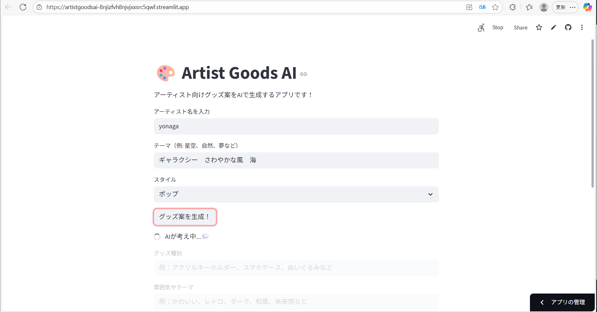
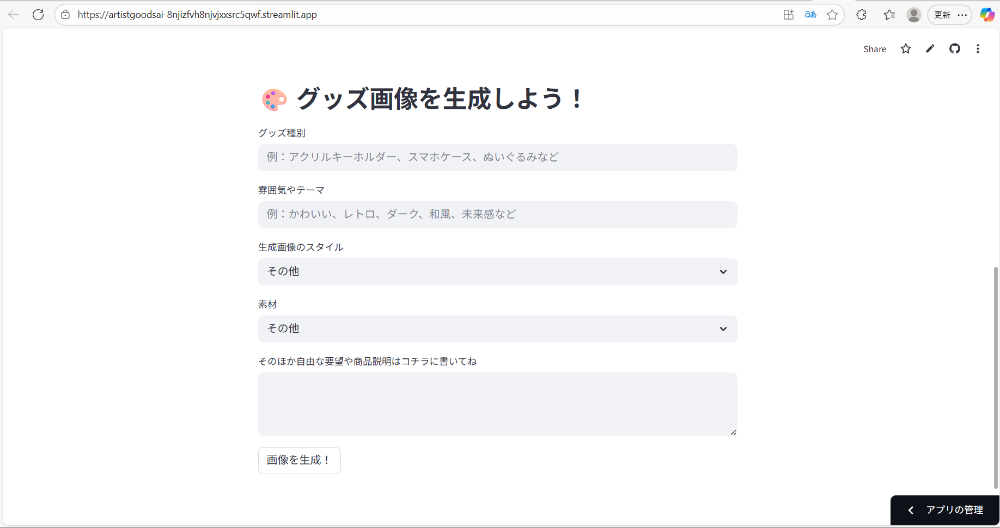
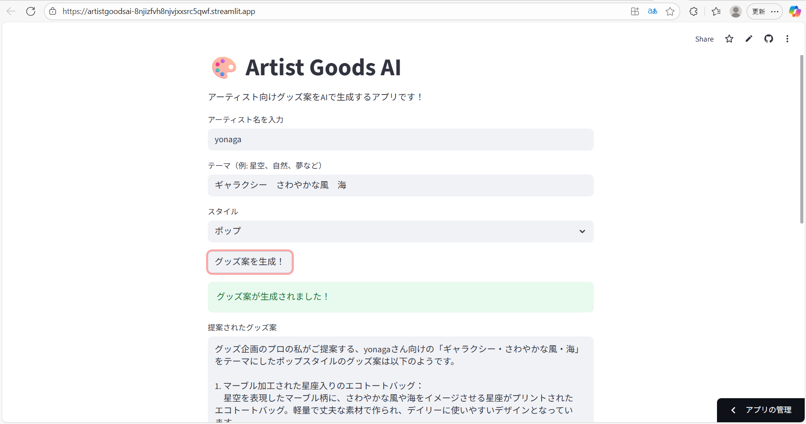
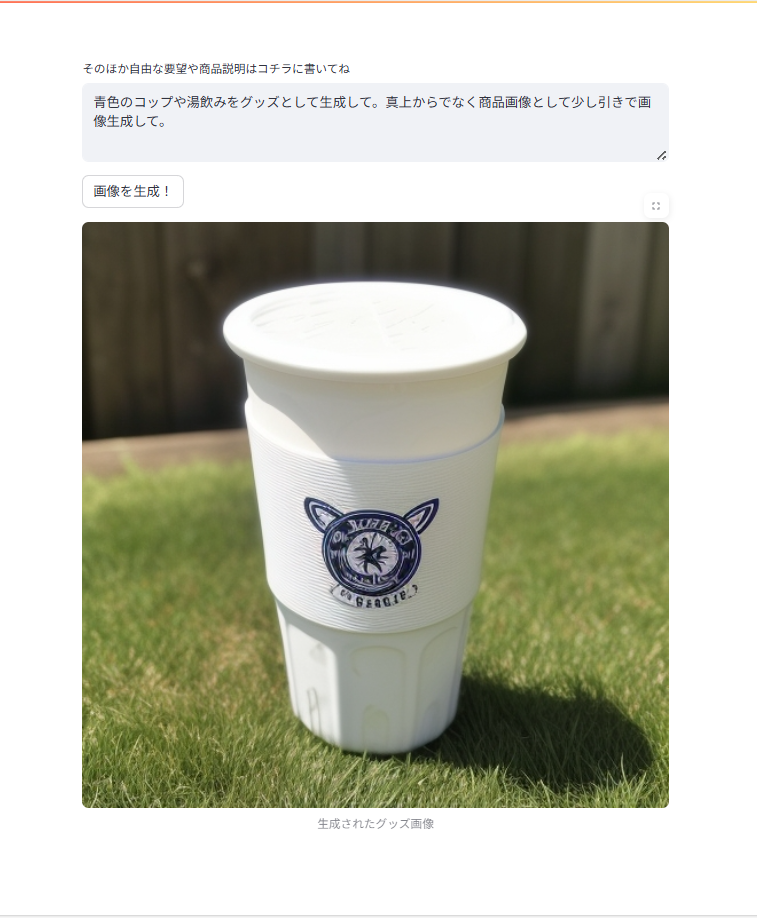

# Artist Goods AI【アーティストグッズ生成AIアプリ】

## アプリ概要
アーティスト名・テーマ・スタイル・素材などを入力することで、AIがグッズ案と商品画像を自動生成するWebアプリです。 OpenAIとReplicateのAPIを活用し、企画とビジュアルの両面からグッズ制作を支援します。

### 解決する課題
- グッズ企画のアイデア出しに時間がかかる問題を解消
- 商品画像のイメージが湧きづらい課題をAIで補完
- 人物・風景・食べ物などの誤生成をなるべく除外し、安全で明確なグッズ画像を生成
- ファンの押し活心を満たす
- 買い逃して売り切れてしまったグッズへの未練を、より良いグッズ案の作成で消化する

---

## ターゲットユーザー / ペルソナ

**アーティスト向けグッズを企画・デザインしたい制作者 / 安全な画像生成を求めるポートフォリオ制作者**
  
- ファン向けグッズを考案したいクリエイター 
- 商品画像のイメージをAIで補完したいデザイナー
- 誤生成を避けたい安全志向の開発者
- 押しへの熱を持て余しているファン

### なぜこのペルソナに焦点を当てたか
自身が「人物や風景の誤爆を避けつつ、明確な商品画像を生成したい」という課題に直面したため。

また、ポートフォリオとして安全・明快・自律的な設計を示す作品にしたかったから。

さらに、自分自身が押し活をする上で「こんなグッズがあったら欲しいな」と妄想したり、「次のツアーでスマホケースが出たら購入しよう」などと考えたりしていたため。

---

## 機能一覧
- **OpenAIによるグッズ案の自動生成**
- **Replicateによる商品画像の生成（人物・風景除外済み）**
- 素材・スタイル・テーマに応じたプロンプト補完
- 色指定の自動抽出と反映
- 過去履歴の保存と表示（ローカル）
- Streamlit UIによる簡単操作

---

## ペルソナが重視する体験と設計意図
- **なるべく人物や風景が出ない安全な画像生成**
- **色や素材が反映された商品画像**
- **APIキーを自分で管理できる自律的な設計**
- **短時間で企画とビジュアルを両方得られる効率性**

> 「安全性」「明快さ」「自律性」を重視した設計

---

## 使用技術
- **Python / Streamlit**
- **OpenAI GPT-3.5 API**
- **Replicate（realistic-vision-v5.1）**
- **Pillow / requests / dotenv / secrets.toml**

---

## プロジェクト構成
artist_goods_ai/

├── main.py                  # Streamlitアプリ本体

├── README.md                # プロジェクト説明

├── requirements.txt         # 使用ライブラリ

├── .gitignore               # secrets.toml除外設定

├── app.log                  # ログファイル

├── goods_history.json       # 履歴保存ファイル

├── utils/                   # ユーティリティモジュール

│   ├── __init__.py

│   ├── goods_generator.py   # グッズ案生成ロジック

│   ├── history_manager.py   # 履歴管理

│   ├── image_generator.py   # 画像生成ロジック

│   ├── image_saver.py       # 画像保存（任意）

│   ├── logger.py            # ログ管理

│   ├── style_manager.py     # スタイル補完

│   └── theme_suggester.py   # テーマ提案ロジック

├── .streamlit/

│   └── secrets.toml         # APIキー管理（Gitには含めない）

├── assets/                  # 素材フォルダ（任意）

├── img/                     # スクリーンショット・生成画像

│   ├── input_screen.png

│   ├── input_screen2.png

│   ├── generation_plan.png

│   └── generated_image.png

---

## 実行方法

### 1. 環境構築
1. Python 3.10 以上をインストール
2. 以下のライブラリをインストール：

   `pip install -r requirements.txt`

### 2. APIキーの設定

.streamlit/secrets.toml を作成し、以下を記述：
   
   `[openai]`
   `api_key = "sk-xxxxxxxxxxxxxxxxxxxxxxxxxxxxxxxxxxxxxxxx"`
   `[replicate]`
   `api_token = "r8-xxxxxxxxxxxxxxxxxxxxxxxxxxxxxxxxxxxxxxxx"`
   
   ※このファイルは .gitignore によりGitHubにはアップロードされません。
   

### 3. 実行手順
   `streamlit run main.py`
   
→ Webブラウザでアプリが起動し、グッズ案と画像が生成できます！

## 実行結果

**表示内容**

- グッズ案（OpenAIによる提案テキスト）
- 商品画像（Replicateによる生成）
- 素材・スタイル・色の反映
- 過去履歴の表示（任意）

**スクリーンショット：**

**実行デモ動画(0:41)：**                                               
https://1drv.ms/v/c/aa77078cc99cfacf/EY4QNDOqcpJBnPiBaQm0KzMBgbIKe7vInqMBeVAdJkBEPg

## アプリ公開ページ（Streamlit Cloud）

👉 Artist Goods AI – グッズ生成アプリ
 
https://artistgoodsai-8njizfvh8njvjxxsrc5qwf.streamlit.app/

※現在は限定公開中。企業向けにメール招待制でアクセス可能です。

## 技術的ハイライト

- APIキーを .streamlit/secrets.toml で安全に管理
- Negative Promptによる人物・風景・食べ物の除外
- 色抽出ロジックによるプロンプト補完
- Streamlit UIによる即時フィードバックと操作性

## 今後の展望

- ユーザー入力式APIキー対応（クレジット保護）
- グッズ案のテンプレート保存機能
- 生成画像のダウンロード機能
- 複数案の同時生成と比較表示
- 生成画像のプロンプトへの忠実性向上
- AIモデル特有の生成の癖の排除
- 要件に沿ったトレーニング・学習をさせたAIモデルの使用

 
 

***
English Version

# Artist Goods AI

## Overview
This is a web application that automatically generates **merchandise ideas and product images** based on inputs such as artist name, theme, style, and material.  
By leveraging the **OpenAI** and **Replicate** APIs, the app supports merchandise creation from both planning and visual perspectives.

### Problems Solved
- Reduce the time spent brainstorming new merchandise ideas  
- Supplement product visualization with AI-generated images  
- Minimize incorrect generations of people, landscapes, or food, ensuring safe and clear product imagery  
- Enhance fans’ engagement with their favorite artists  
- Relieve frustration about missing out on sold-out merchandise by generating even better ideas  

---

## Target Users / Personas

**Creators who design merchandise for artists / Portfolio developers seeking safe image generation**

- Creators who want to design fan-oriented goods  
- Designers who want AI to help visualize product images  
- Developers who prioritize safe outputs and want to avoid incorrect generations  
- Fans who want to channel their enthusiasm into concrete ideas  

### Why These Personas?
Because I personally faced the challenge of wanting to generate **clear product images without unwanted people or landscapes**.  

Additionally, I wanted to showcase a portfolio piece that demonstrates **safety, clarity, and autonomy** in design.  

Finally, as a fan myself, I often thought things like *“I wish this kind of merch existed”* or *“If a smartphone case comes out in the next tour, I’ll buy it.”*  

---

## Features
- **Automatic merchandise idea generation with OpenAI**  
- **Product image generation with Replicate** (excluding people/landscapes)  
- Prompt completion based on material, style, and theme  
- Automatic color extraction and reflection in images  
- Local storage and display of generation history  
- Simple user interface built with Streamlit  

---

## User Experience & Design Intent
- **Safe image generation with minimal unwanted people or landscapes**  
- **Accurate reflection of colors and materials in product images**  
- **Autonomous design where users manage their own API keys**  
- **Efficiency in obtaining both ideas and visuals in a short time**  

> Design values: **Safety**, **Clarity**, **Autonomy**

---

## Tech Stack
- **Python / Streamlit**  
- **OpenAI GPT-3.5 API**  
- **Replicate (realistic-vision-v5.1)**  
- **Pillow / requests / dotenv / secrets.toml**  

---

## Project Structure
artist_goods_ai/

├── main.py # Main Streamlit app

├── README.md # Project description

├── requirements.txt # Dependencies

├── .gitignore # Excludes secrets.toml

├── app.log # Log file

├── goods_history.json # Local history storage

├── utils/ # Utility modules

│ ├── init.py

│ ├── goods_generator.py # Merchandise idea generation logic

│ ├── history_manager.py # History management

│ ├── image_generator.py # Image generation logic

│ ├── image_saver.py # Image saving (optional)

│ ├── logger.py # Logging

│ ├── style_manager.py # Style completion

│ └── theme_suggester.py # Theme suggestion logic

├── .streamlit/

│ └── secrets.toml # API key management (not included in Git)

├── assets/ # Optional asset folder

├── img/ # Screenshots & generated images

│ ├── input_screen.png

│ ├── input_screen2.png

│ ├── generation_plan.png

│ └── generated_image.png

---

## How to Run

### 1. Setup Environment
1. Install Python 3.10 or higher  
2. Install dependencies:  

   `pip install -r requirements.txt`

###2. Configure API Keys

Create .streamlit/secrets.toml and add:

   `[openai]`
   `api_key = "sk-xxxxxxxxxxxxxxxxxxxxxxxxxxxxxxxxxxxxxxxx"`
   `[replicate]`
   `api_token = "r8-xxxxxxxxxxxxxxxxxxxxxxxxxxxxxxxxxxxxxxxx"`
   

※ This file is excluded from GitHub via .gitignore.

###3. Run the App

   `streamlit run main.py`

→ Opens in your browser and generates merchandise ideas & images!

## Output

**Displayed Results**

- Merchandise idea (text generated by OpenAI)
- Product image (generated by Replicate)
- Reflected material, style, and color
- Past history display (optional)

**Screenshots:**

**Demo Video (0:41):**                                               
https://1drv.ms/v/c/aa77078cc99cfacf/EY4QNDOqcpJBnPiBaQm0KzMBgbIKe7vInqMBeVAdJkBEPg

## Live App (Streamlit Cloud)

👉 Artist Goods AI – Merchandise Generation App
 
https://artistgoodsai-8njizfvh8njvjxxsrc5qwf.streamlit.app/

※ Currently private. Accessible by email invitation for enterprise use.

## Technical Highlights

- Secure API key management via .streamlit/secrets.toml
- Negative prompts exclude people, landscapes, and food
- Color extraction logic enhances prompt accuracy
- Streamlit UI provides immediate feedback and ease of use

## Future Improvements

- User-provided API key input (protecting credits)
- Save/load templates for merchandise ideas
- Download function for generated images
- Generate and compare multiple ideas simultaneously
- Improve faithfulness of images to prompts
- Reduce quirks of AI model generations
- Train or fine-tune models tailored to specific requirements

 
 

